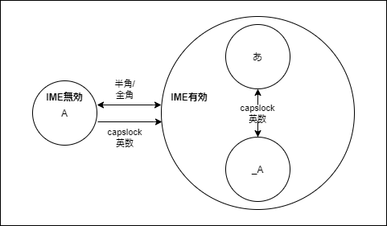
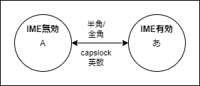

# key-settings

## Windows

`_A` をつかわないすべての方へ

before(default)

after

settings

1. タスクバーの `A` または `あ` を右クリック -> `プロパティ` -> `Google日本語入力のプロパティ`を表示
2. `キー設定の編集`の`選択`をクリック
3. `Eisu` が `英数入力切り替え` になっている設定(3箇所)を `IMEを無効化`　に変更する ( `Hankaku/Zenkaku` と同じ設定にする )
